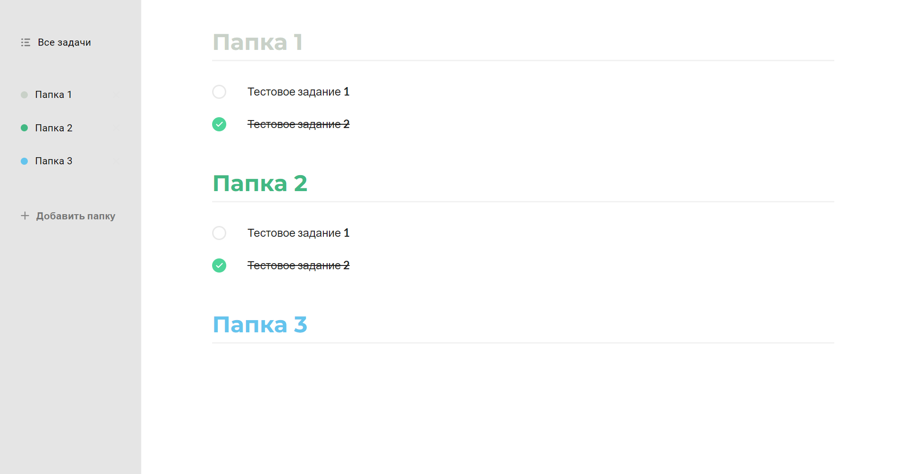
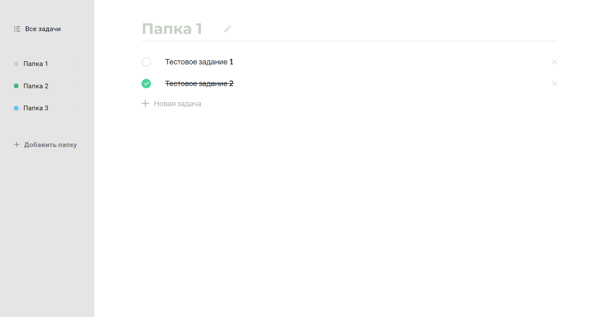
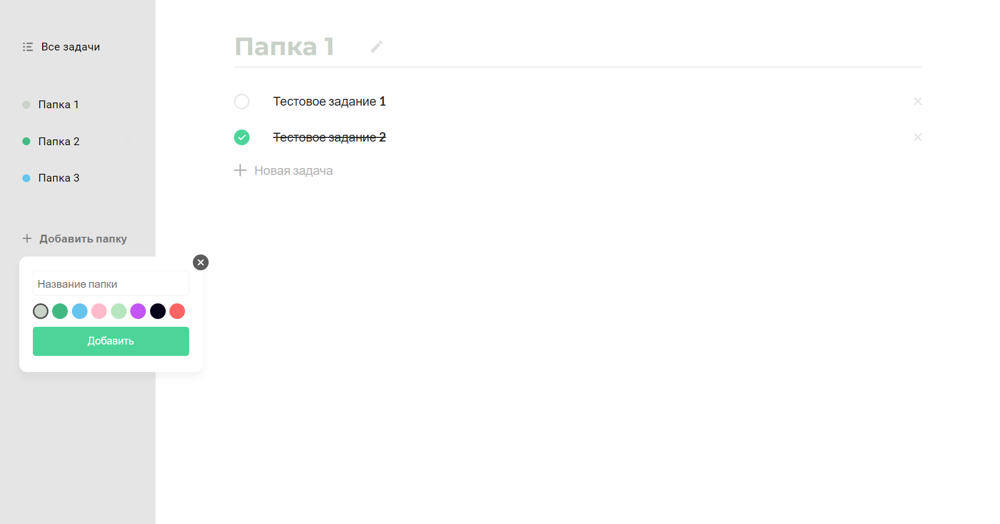

# React todo

Дизайн проекта взят с [Todo ReactJS](https://www.figma.com/file/OP7oFTNqV8tPZyh2zSgCaX/Todo-ReactJS?node-id=9%3A0)

Проект использует следующий стек технологий:

<ul>
  <li>React</li>
  <li>Redux toolkit</li>
  <li>HTML5/SCSS</li>
</ul>

Проект, покрывает следующие области React

<ul>
  <li>Модальные окна</li>
  <li>Колбэки</li>
  <li>CSS модули</li>
  <li>Хуки useEffect, useState, useRef</li>
  <li>Управляемые инпуты</li>
  <li>Использование локального хранилища</li>
</ul>

### Примеры

Главная страница

Редактирование папки

Модальное окно

